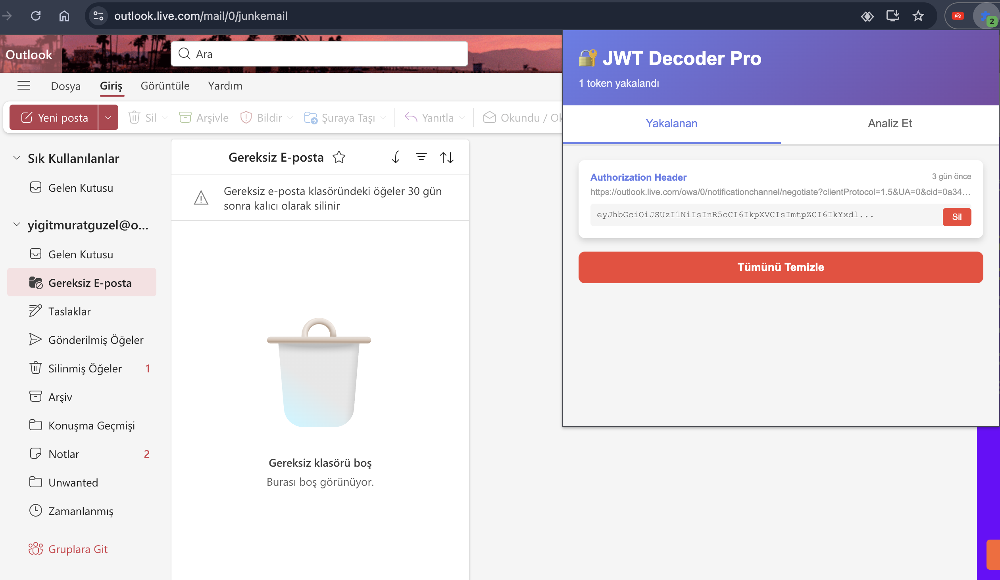
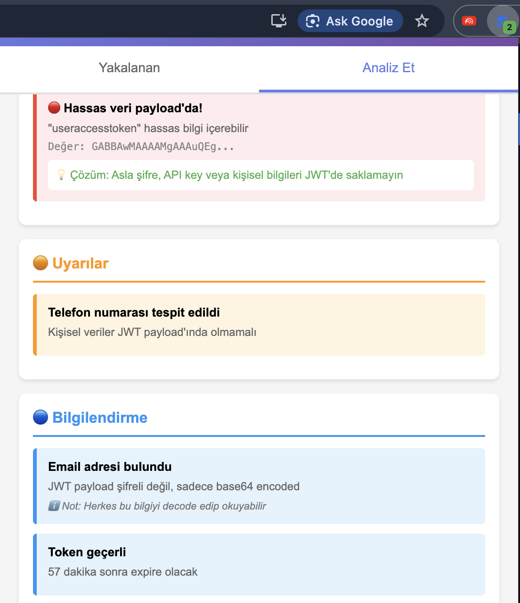
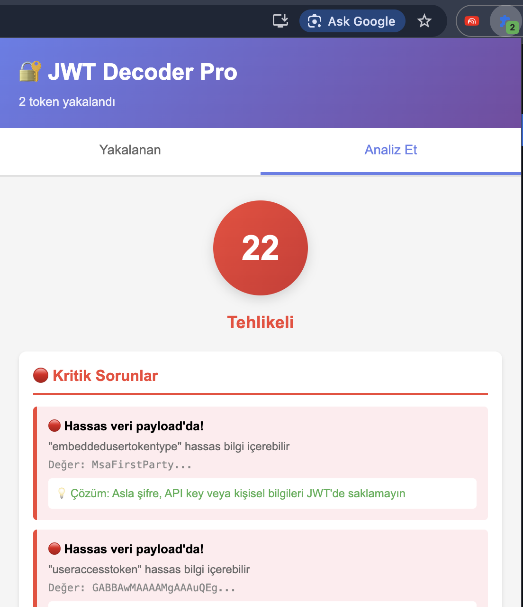

# 🔐 JWT Decoder Pro

Profesyonel JWT (JSON Web Token) analiz ve güvenlik tarama aracı. Web uygulamalarındaki JWT tokenlarını otomatik olarak yakalar, decode eder ve güvenlik açıklarını tespit eder.


## ✨ Özellikler

### 🎯 Otomatik JWT Yakalama
- **Authorization Header'lardan** otomatik token yakalama
- **Cookie'lerden** JWT tespiti
- **localStorage/sessionStorage** taraması
- Gerçek zamanlı badge bildirimleri

### 🔍 Detaylı Analiz
- JWT Header, Payload ve Signature decode
- JSON formatında okunabilir gösterim
- Token metadata bilgileri (kaynak, URL, zaman)

### 🛡️ Güvenlik Kontrolü
- **Algoritma Güvenliği**: `alg:none`, zayıf algoritmalar (MD5, SHA1)
- **Payload Analizi**: Hassas veri tespiti (password, API key, credit card)
- **Expiration Kontrolü**: Süre dolumu ve token ömrü analizi
- **Role/Permission Kontrolü**: Admin/superuser gibi yüksek yetkili roller
- **PII Tespiti**: Email, telefon numarası gibi kişisel veriler
- **Güvenlik Skoru**: 0-100 arası risk değerlendirmesi

### 💡 Kullanıcı Dostu Arayüz
- Modern ve responsive tasarım
- Renkli uyarı sistemi (🔴 Kritik, 🟠 Uyarı, 🔵 Bilgilendirme)
- Copy to clipboard özelliği
- Token geçmişi ve yönetimi
- Tab-based navigasyon

## 📦 Kurulum

### Chrome Web Store'dan (Yayınlandığında)
1. [Chrome Web Store](#) sayfasını ziyaret edin
2. "Add to Chrome" butonuna tıklayın
3. İzinleri onaylayın

### Manuel Kurulum (Developer Mode)
1. Bu repository'yi indirin:
```bash
   git clone https://github.com/kullaniciadi/jwt-decoder-pro.git
   cd jwt-decoder-pro
```

2. Chrome'u açın ve şu adrese gidin:
```
   chrome://extensions/
```

3. Sağ üst köşedeki **"Developer mode"** u aktif edin

4. **"Load unpacked"** butonuna tıklayın

5. İndirdiğiniz `jwt-decoder-pro` klasörünü seçin

6. Extension yüklendi! ✅

## 🚀 Kullanım

### Otomatik Yakalama
1. Extension'ı yükledikten sonra herhangi bir web sitesinde gezinin
2. JWT tokenları otomatik olarak yakalanacak
3. Extension icon'undaki badge sayısını takip edin
4. Popup'ı açarak yakalanan tokenları görüntüleyin

### Manuel Analiz
1. Extension icon'una tıklayın
2. "Analiz Et" tab'ına geçin
3. JWT token'ınızı yapıştırın
4. "Decode & Analyze" butonuna tıklayın
5. Detaylı güvenlik raporu alın

## 🎓 JWT Güvenlik Kontrolleri

### ⚠️ Tespit Edilen Zafiyetler

| Zafiyet | Açıklama | Severity |
|---------|----------|----------|
| `alg: none` | Token imzasız, kolayca forge edilebilir | 🔴 CRITICAL |
| Hassas Veri | Password, API key gibi veriler payload'da | 🔴 CRITICAL |
| Admin Role | Yüksek yetkili roller açıkta | 🔴 HIGH |
| Expiration Yok | Token hiç expire olmuyor | 🟠 CRITICAL |
| Zayıf Algoritma | MD5, SHA1 gibi deprecated algoritmalar | 🔴 HIGH |
| Uzun Token Ömrü | 1 yıldan uzun geçerlilik süresi | 🟠 HIGH |
| PII Data | Email, telefon gibi kişisel veriler | 🟠 MEDIUM |

## 📸 Ekran Görüntüleri

### Yakalanan Tokenlar


### Güvenlik Analizi


### Güvenlik Skoru


## 🛠️ Teknolojiler

- **Manifest V3** - Chrome Extension API
- **Vanilla JavaScript** - Dependency yok, saf JS
- **Chrome Storage API** - Token storage
- **WebRequest API** - Network monitoring
- **Content Scripts** - localStorage/sessionStorage tarama

## 📂 Proje Yapısı
```
jwt-decoder-pro/
├── manifest.json          # Extension configuration
├── background.js          # Service worker (JWT yakalama)
├── content.js            # localStorage/sessionStorage scanner
├── popup.html            # Ana UI
├── popup.js              # UI logic
├── security-checker.js   # Güvenlik analiz motoru
├── icon.png              # Extension icon
└── README.md
```

## 🔒 Güvenlik ve Gizlilik

- ❌ **Hiçbir veri dışarı gönderilmez**
- ✅ Tüm analiz tamamen local (tarayıcıda)
- ✅ Token'lar sadece Chrome Storage'da saklanır
- ✅ Açık kaynak - kodu inceleyebilirsiniz

## 🤝 Katkıda Bulunma

Katkılarınızı bekliyoruz! Lütfen şu adımları izleyin:

1. Fork edin
2. Feature branch oluşturun (`git checkout -b feature/amazing-feature`)
3. Commit edin (`git commit -m 'feat: Add amazing feature'`)
4. Push edin (`git push origin feature/amazing-feature`)
5. Pull Request açın

### Geliştirme Kuralları
- Clean code prensiplerine uyun
- Anlamlı commit mesajları yazın
- Test edin, sonra push edin

## 🐛 Hata Bildirimi

Bir hata mı buldunuz? [Issue açın](https://github.com/kullaniciadi/jwt-decoder-pro/issues)

Lütfen şunları ekleyin:
- Chrome versiyonu
- Extension versiyonu
- Adım adım hatayı nasıl reproduce edebiliriz
- Console hataları (varsa)
- Ekran görüntüsü

## 📝 TODO / Gelecek Özellikler

- [ ] Firefox desteği
- [ ] Weak secret brute force
- [ ] JWT Builder (custom token oluşturma)
- [ ] Export/Import özelliği (JSON, CSV)
- [ ] Dark mode
- [ ] Çoklu dil desteği (EN, TR, DE)
- [ ] Advanced filtering
- [ ] JWT signature verification
- [ ] Cloud sync (optional)

## 📜 Lisans

MIT License - Detaylar için [LICENSE](LICENSE) dosyasına bakın.

## 👨‍💻 Geliştirici

**[Adınız]**
- GitHub: [@kullaniciadi](https://github.com/kullaniciadi)
- LinkedIn: [Profiliniz](https://linkedin.com/in/profiliniz)
- Email: email@example.com

## 🙏 Teşekkürler

- JWT.io - JWT debugging için
- Chrome Extension Documentation
- Siber güvenlik topluluğu

## ⭐ Star History

Projeyi beğendiyseniz yıldız vermeyi unutmayın!

[](https://star-history.com/#kullaniciadi/jwt-decoder-pro&Date)

---

**Uyarı:** Bu araç sadece eğitim ve yasal penetrasyon testleri için tasarlanmıştır. Kötü niyetli kullanımdan geliştirici sorumlu değildir.
```

---

## 📄 LICENSE (MIT)
```
MIT License

Copyright (c) 2025 [Adınız]

Permission is hereby granted, free of charge, to any person obtaining a copy
of this software and associated documentation files (the "Software"), to deal
in the Software without restriction, including without limitation the rights
to use, copy, modify, merge, publish, distribute, sublicense, and/or sell
copies of the Software, and to permit persons to whom the Software is
furnished to do so, subject to the following conditions:

The above copyright notice and this permission notice shall be included in all
copies or substantial portions of the Software.

THE SOFTWARE IS PROVIDED "AS IS", WITHOUT WARRANTY OF ANY KIND, EXPRESS OR
IMPLIED, INCLUDING BUT NOT LIMITED TO THE WARRANTIES OF MERCHANTABILITY,
FITNESS FOR A PARTICULAR PURPOSE AND NONINFRINGEMENT. IN NO EVENT SHALL THE
AUTHORS OR COPYRIGHT HOLDERS BE LIABLE FOR ANY CLAIM, DAMAGES OR OTHER
LIABILITY, WHETHER IN AN ACTION OF CONTRACT, TORT OR OTHERWISE, ARISING FROM,
OUT OF OR IN CONNECTION WITH THE SOFTWARE OR THE USE OR OTHER DEALINGS IN THE
SOFTWARE.
```

---

## 📄 .gitignore
```
# Chrome Extension
*.crx
*.pem

# System Files
.DS_Store
Thumbs.db

# Editor
.vscode/
.idea/
*.swp
*.swo

# Logs
*.log

# Temporary
temp/
tmp/
